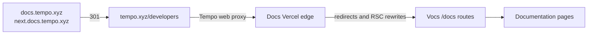

<br>
<br>

<p align="center">
  <a href="https://tempo.xyz">
    <picture>
      <source media="(prefers-color-scheme: dark)" srcset="/public/lockup-dark.svg">
      
    </picture>
  </a>
</p>

<br>
<br>

# Tempo Documentation

This repository contains documentation for the Tempo blockchain, including the Protocol Specifications, Litepaper, and Getting Started guides.

[tempo.xyz/developers](https://tempo.xyz/developers)

## Usage

```sh
pnpm install
```

```sh
pnpm dev            # Start development server
pnpm check          # Run linting + formatting
pnpm check:types    # Run type checks
pnpm build          # Build for production
pnpm preview        # Preview the production build
```

## Routing and redirects

The canonical public documentation URL is [`https://tempo.xyz/developers`](https://tempo.xyz/developers). This repository serves the docs application, while the Tempo web application proxies that public mount to this deployment.



### Routing ownership

| Surface | Owner | Purpose |
| --- | --- | --- |
| `tempo.xyz/developers/*` | Tempo web | Canonical public mount and proxy to this deployment. |
| `docs.tempo.xyz` and `next.docs.tempo.xyz` | `vercel.json` | Permanent redirects to the canonical public URL. |
| Native `/docs/*` paths | `vocs.config.ts` | Page-level redirects after a request reaches Vocs. |
| Proxied `/developers/docs/*` paths | `vercel.json` | Compatibility redirects that must run before Vocs. |
| RSC artifacts | `vercel.json`, Vite, and the docs layout | Normalize the proxy mount until the docs runtime can own `/developers` natively. |

`developers.tempo.xyz` is a proxy origin. Do not add it to the legacy-host redirect matcher: that creates a redirect loop through Tempo web.

### Redirect invariants

- A legacy URL redirects directly to its canonical URL; do not add redirect chains.
- Native and proxied forms of a removed docs page both remain supported. Production Vocs redirects must use the canonical absolute destination so a proxy-relative `Location` cannot escape `/developers`.
- Preserve path parameters and query strings unless a route intentionally maps to one replacement page.
- Keep API compatibility routes exact. A broad `/api/:path*` redirect would shadow real handlers such as `/api/og` and `/api/feedback`.
- Keep Vercel's `trailingSlash: false` and Vocs' `trailingSlashRedirect: false` paired. Changing only one can reintroduce the `/developers/docs` loop.

### Move or remove a docs page

1. Add the native redirect in `vocs.config.ts`. For a proxied legacy route, add it to [`src/lib/docs-routing.ts`](./src/lib/docs-routing.ts) so the Vercel mirror, tests, and smoke check share the contract.
2. Add the matching `/developers/docs/...` Vercel redirect when the page is publicly available through the proxy mount.
3. Run `pnpm test`, `pnpm check:types`, and `pnpm test:routing:smoke` against a deployment. The smoke command requires `DOCS_ROUTING_SMOKE_CANONICAL_ORIGIN` and `DOCS_ROUTING_SMOKE_LEGACY_ORIGIN`.
4. For proxy or canonical URL changes, coordinate the Tempo web deployment first. Verify the public canonical URL before enabling legacy-host redirects.

The pull-request route guard rejects deleted docs pages without both native and proxied redirects, unless the `docs-removal-ok` label explicitly records an intentional break. The scheduled **Docs routing smoke** workflow tests the deployed production redirect contract every day.

## Contributing

Our contributor guidelines can be found in [`CONTRIBUTING.md`](https://github.com/tempoxyz/docs?tab=contributing-ov-file).

## Security

See [`SECURITY.md`](https://github.com/tempoxyz/docs?tab=security-ov-file).

## License

Licensed under either of [Apache License](./LICENSE-APACHE), Version
2.0 or [MIT License](./LICENSE-MIT) at your option.

Unless you explicitly state otherwise, any contribution intentionally submitted
for inclusion in these crates by you, as defined in the Apache-2.0 license,
shall be dual licensed as above, without any additional terms or conditions.
