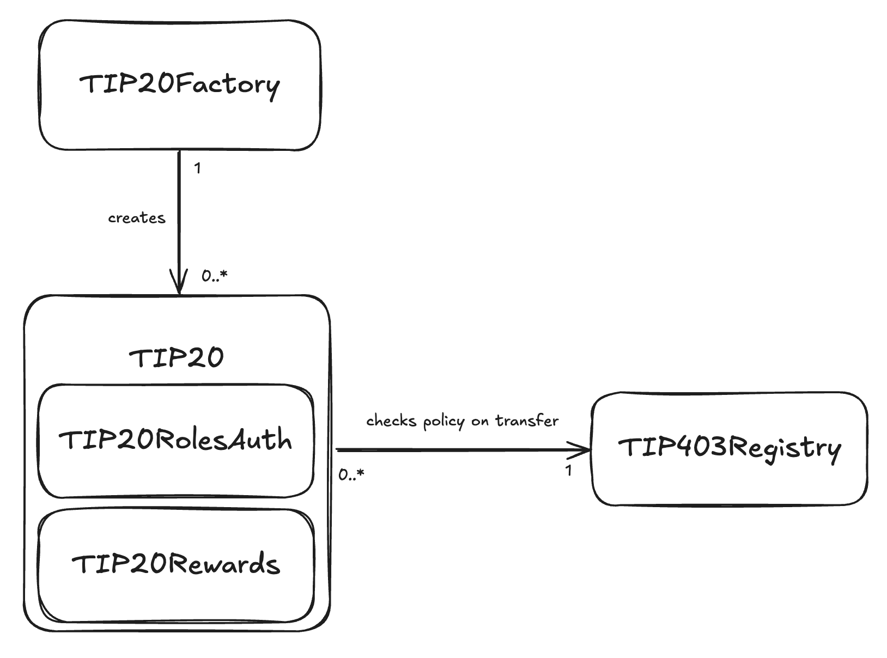

# TIP-20 Token

## Abstract

TIP-20 is a fungible token standard containing a comprehensive set of features to serve a wide range of token use cases.

## Motivation

All major stablecoins today use the ERC-20 token standard. While ERC-20 provides a solid foundation for fungible tokens, it lacks features critical for stablecoin issuers today such as memoized transfers, transfer policies, pause functionality and rewards distribution.

TIP-20 extends ERC-20 building these features into the token directly and is implemented natively in Tempo. This approach makes token operations much more efficient, allows issuers to quickly set up on Tempo and enables deeper integration with the other token infrastructure on Tempo like the StablecoinExchange.

## Specification

TIP-20 tokens support standard fungible token operations such as standard token transfers and transfers with an attached memo, minting and burning tokens, a role-based access control system for token administrative operations, and a system of rewards distribution. This is provided via multiple components as shown below.



### Components

#### TIP20Factory

New TIP-20 tokens are created through the TIP-20Factory. The factory uses a deterministic address schema; token addresses are assigned sequentially starting at `0x20C0000000000000000000000000000000000001` and this is incremented with each deployment. Note that address `0x20C0000000000000000000000000000000000000` is the address for LinkingUSD. Learn more about LinkingUSD [here](#TODO).

Because of this, addresses of all TIP-20 tokens on Tempo have a prefix of `0x20c000000000000000000000`.

#### TIP-20

The main TIP-20 contract contains standard token transfer functionality such as transferring tokens with `transfer` or `approve` and `transferFrom`. TIP-20 also supports minting and burning tokens with `mint` and `burn`.

If memos are required for operations, you could use TIP-20's `transferWithMemo`, `transferFromWithMemo`, `mintWithMemo` and `burnWithMemo`.

The token can be paused with `pause` and `unpause`. When a token is paused, all token transfer operations will be blocked.

#### TIP20 Rewards

The main TIP-20 contract also contains the implementation for distributing rewards to token holders. Learn more about rewards [here](./reward-distribution.mdx).

#### TIP20RolesAuth

The TIP20RolesAuth contract contains functionality pertaining to role-based access control.

#### TIP403Registry

The TIP-403 registry contract provides optional policies that can be applied and checked for token transfers operations. Learn more about the registry [here](./tip-403.mdx).

### Interfaces

#### TIP-20 Token Attributes

All TIP-20 tokens contain the following metadata and can be retrieved with getter functions.

```solidity
function name() external view returns (string memory);
```

Gets the token name (e.g. "Dai").

```solidity
function symbol() external view returns (string memory);
```

Gets the token symbol (e.g. "DAI").

```solidity
function currency() external view returns (string memory);
```

Gets the token currency string (e.g. "USD", "EURO").

```solidity
function decimals() external pure returns (uint8);
```

Gets the number of decimals for the token. Always returns `6`.

```solidity
function totalSupply() external view returns (uint256);
```

Gets the total amount of tokens in circulation.

```solidity
function quoteToken() external view returns (ITIP20);
```

Gets the token to be paired with in the StablecoinExchange for swaps.

```solidity
function nextQuoteToken() external view returns (ITIP20);
```

Gets the next quote token staged for update.

```solidity
function paused() external view returns (bool);
```

Gets whether the token is currently paused.

```solidity
function supplyCap() external view returns (uint256);
```

Gets the maximum supply cap for the token, which is checked on mint operations.

```solidity
function transferPolicyId() external view returns (uint64);
```

Gets the current transfer policy ID. See [TIP-403 registry](./tip-403.mdx) for more info.


#### New Token Creation

```solidity
function createToken(
    string memory name,
    string memory symbol,
    string memory currency,
    ITIP20 quoteToken,
    address admin
) external returns (address)
```

`TIP20Factory` creates a new token with the provided name, symbol, currency, quoteToken, and admin. Returns the address of the created token.

#### Role-Based Access Control

There are 5 role types within all TIP-20 tokens: `DEFAULT_ADMIN_ROLE`, `PAUSE_ROLE`, `UNPAUSE_ROLE`, `ISSUER_ROLE`, and `BURN_BLOCKED_ROLE`.

Every role has a set of role admins, and only role admins are able to grant or revoke that role for any address. By default, the role admin of every role (including `DEFAULT_ADMIN_ROLE`) is the `DEFAULT_ADMIN_ROLE`.

Any address with an active role can renounce that role via `renounceRole`:

```solidity
function renounceRole(bytes32 role) external;
```

##### DEFAULT_ADMIN_ROLE

The `DEFAULT_ADMIN_ROLE` of a TIP-20 can call these functions on that TIP-20 token:

```solidity
function changeTransferPolicyId(uint64 newPolicyId) external;
```

Changes the transfer policy id used from the TIP-403 registry. See [TIP-403 registry](./tip-403.mdx) for more info.

```solidity
function setNextQuoteToken(ITIP20 newQuoteToken) external;
```

Stages a change in the quote token for the token pair in StablecoinExchange.

```solidity
function completeQuoteTokenUpdate() external;
```

Completes the quote token update process.

```solidity
function setSupplyCap(uint256 newSupplyCap) external;
```

Sets the maximum supply cap for the token. Limited to `type(uint128).max`.

```solidity
function grantRole(bytes32 role, address account) external;
```

Grants the role to an account. This is technically permissioned to `roleAdmin` which defaults to `DEFAULT_ADMIN_ROLE`.

```solidity
function revokeRole(bytes32 role, address account) external;
```

Revokes a role from an account. This is technically permissioned to `roleAdmin` which defaults to `DEFAULT_ADMIN_ROLE`.

```solidity
function setRoleAdmin(bytes32 role, bytes32 adminRole) external;
```

Sets the admin role for a specific role. This is technically permissioned to `roleAdmin` which defaults to `DEFAULT_ADMIN_ROLE`.

##### PAUSE_ROLE

The `PAUSE_ROLE` can be used to call this function:

```solidity
function pause() external;
```

Pauses the contract, preventing transfers and other operations.

##### UNPAUSE_ROLE

The `UNPAUSE_ROLE` can be used to call this function:

```solidity
function unpause() external;
```

Unpauses the contract, allowing transfers and other operations to resume.

##### ISSUER_ROLE

The `ISSUER_ROLE` can call the following functions. Details on what each function does are in the ***Token Transfer Operations*** section below.

```solidity
function mint(address to, uint256 amount) external;
function mintWithMemo(address to, uint256 amount, bytes32 memo) external;
function burn(uint256 amount) external;
function burnWithMemo(uint256 amount, bytes32 memo) external;
```

##### BURN_BLOCKED_ROLE

```solidity
function burnBlocked(address from, uint256 amount) external;
```

Burns tokens from an account that is not authorized to transfer tokens under the current transfer policy ID.

#### Token Operations

The following functions pertain to token transfers. These functions all emit a `Transfer` event.

```solidity
function transfer(address to, uint256 amount) external returns (bool);
```

Transfers `amount` of tokens from `caller` to `to`. Returns `true` if success.

```solidity
function transferWithMemo(address to, uint256 amount, bytes32 memo) external;
```

Transfers `amount` of tokens from `caller` to `to`. Emits an additional `TransferWithMemo` event. Note: this will be updated to also return a `bool` success in the next version.

```solidity
function transferFrom(address from, address to, uint256 amount) external returns (bool);
```

Transfers `amount` of tokens from `from` to `to`. Requires an `approve` from `from` to `caller` beforehand. Returns `true` if success.

```solidity
function transferFromWithMemo(address from, address to, uint256 amount, bytes32 memo) external returns (bool);
```

Transfers `amount` of tokens from `from` to `to`. Requires an `approve` from `from` to `caller` beforehand. Returns `true` if success. Emits an additional `TransferWithMemo` event.

```solidity
function mint(address to, uint256 amount) external;
```

Transfers `amount` of tokens from address(0) to `to`. Caller must have `ISSUER_ROLE`.

```solidity
function mintWithMemo(address to, uint256 amount, bytes32 memo) external;
```

Transfers `amount` of tokens from address(0) to `to` and adds it to circulation. Caller must have `ISSUER_ROLE`. Emits an additional `TransferWithMemo` event.

```solidity
function burn(uint256 amount) external;
```

Transfers `amount` of tokens from `caller` to address(0) and removes it from circulation. Caller must have `ISSUER_ROLE`.

```solidity
function burnWithMemo(uint256 amount, bytes32 memo) external;
```

Transfers `amount` of tokens from `caller` to address(0) and removes it from circulation. Caller must have `ISSUER_ROLE`. Emits an additional `TransferWithMemo` event.


#### System Functions

TIP-20 tokens also implement system-level transfer functions. These are restricted to calls originating from address(0), ensuring only the system can invoke them.

```solidity
function systemTransferFrom(address from, address to, uint256 amount) external returns (bool)
```

This function is used by the Fee AMM and transfers `amount` of tokens from `from` to `to`. Returns `true` if success.

```solidity
function transferFeePreTx(address from, uint256 amount) external;
```

```solidity
function transferFeePostTx(address to, uint256 refund, uint256 actualUsed) external;
```

These functions are used by the Fee Manager to transfer fee tokens to pay transacton fees.


#### Other Token Functions

```solidity
function approve(address spender, uint256 amount) external returns (bool);
```

Approves the `spender` to spend `amount` of tokens from `caller`. Returns `true` if success.

```solidity
function allowance(address owner, address spender) external view returns (uint256);
```

Reads the current amount `approved` from the `owner` to the `spender`.

```solidity
function balanceOf(address account) external view returns (uint256);
```

Reads the current token balance of the `account`.


#### Token Rewards Distribtion

See [rewards distribution](./reward-distribution.mdx) for more information.


#### Other Misc Interface Functions

```solidity
function BURN_BLOCKED_ROLE() external view returns (bytes32)
```

The `bytes32` value associated with `BURN_BLOCKED_ROLE` which is `keccak256("BURN_BLOCKED_ROLE")`.

```solidity
function ISSUER_ROLE() external view returns (bytes32)
```

The `bytes32` value associated with `ISSUER_ROLE` which is `keccak256("ISSUER_ROLE")`.

```solidity
function PAUSE_ROLE() external view returns (bytes32)
```

The `bytes32` value associated with `PAUSE_ROLE` which is `keccak256("PAUSE_ROLE")`.

```solidity
function UNPAUSE_ROLE() external view returns (bytes32)
```

The `bytes32` value associated with `UNPAUSE_ROLE` which is `keccak256("UNPAUSE_ROLE")`.

#### Events

```solidity
event Approval(address indexed owner, address indexed spender, uint256 amount);
event Burn(address indexed from, uint256 amount);
event BurnBlocked(address indexed from, uint256 amount);
event Mint(address indexed to, uint256 amount);
event NextQuoteTokenSet(address indexed updater, ITIP20 indexed nextQuoteToken);
event PauseStateUpdate(address indexed updater, bool isPaused);
event QuoteTokenUpdate(address indexed updater, ITIP20 indexed newQuoteToken);
event RewardCanceled(address indexed funder, uint64 indexed id, uint256 refund);
event RewardRecipientSet(address indexed holder, address indexed recipient);
event RewardScheduled(address indexed funder, uint64 indexed id, uint256 amount, uint32 durationSeconds);
event SupplyCapUpdate(address indexed updater, uint256 indexed newSupplyCap);
event Transfer(address indexed from, address indexed to, uint256 amount);
event TransferPolicyUpdate(address indexed updater, uint64 indexed newPolicyId);
event TransferWithMemo(address indexed from, address indexed to, uint256 amount, bytes32 indexed memo);
event RoleMembershipUpdated(bytes32 indexed role, address indexed account, address indexed sender, bool hasRole);
event RoleAdminUpdated(bytes32 indexed role, bytes32 indexed newAdminRole, address indexed sender);
```

#### Errors

```solidity
error ContractPaused(); // Token operations are blocked because the contract is paused
error InsufficientAllowance(); // Spender does not have enough allowance to transfer the requested amount
error InsufficientBalance(uint256 currentBalance, uint256 expectedBalance, address token); // Account does not have enough tokens for the requested operation
error InvalidAmount(); // Amount provided is zero or invalid for the operation
error InvalidCurrency(); // Currency identifier is not valid (defined in interface but not currently used in implementation)
error InvalidQuoteToken(); // Quote token is not a valid TIP-20 token, creates a circular reference, or has currency mismatch
error InvalidRecipient(); // Cannot transfer to another TIP-20 token address
error InvalidSupplyCap(); // New supply cap is less than current total supply
error NoOptedInSupply(); // Cannot distribute rewards because no token holders have opted in
error NotStreamFunder(); // Caller is not the funder of the reward stream
error PolicyForbids(); // Transfer policy denies authorization for sender or receiver
error StreamInactive(); // Reward stream does not exist or has already ended
error SupplyCapExceeded(); // Operation would exceed the maximum supply cap
error Unauthorized(); // Caller does not have the required role or permission for this operation
```