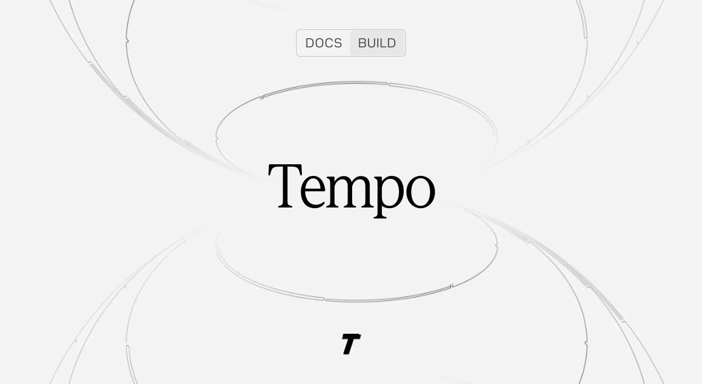
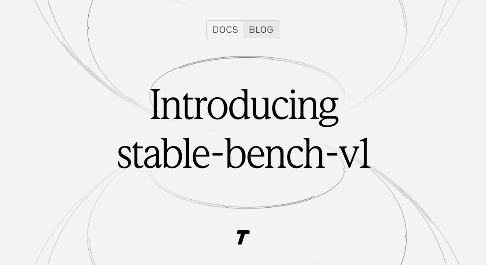
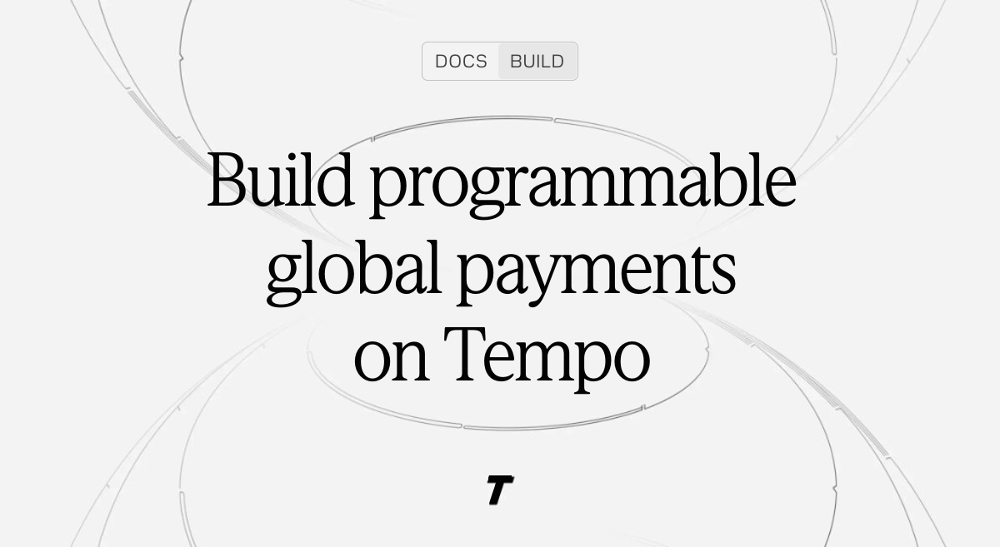
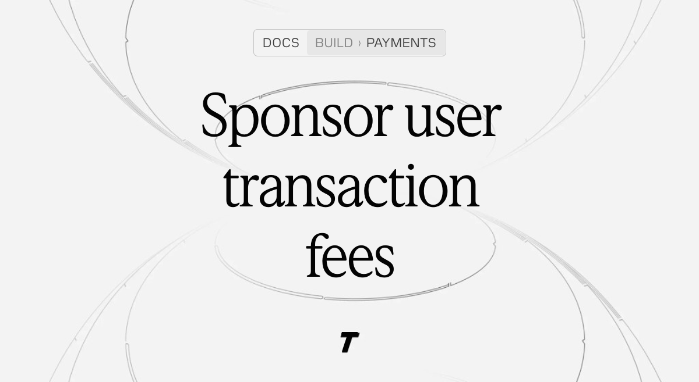
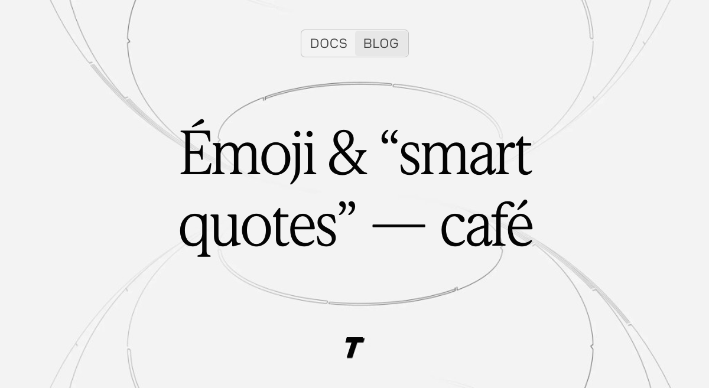
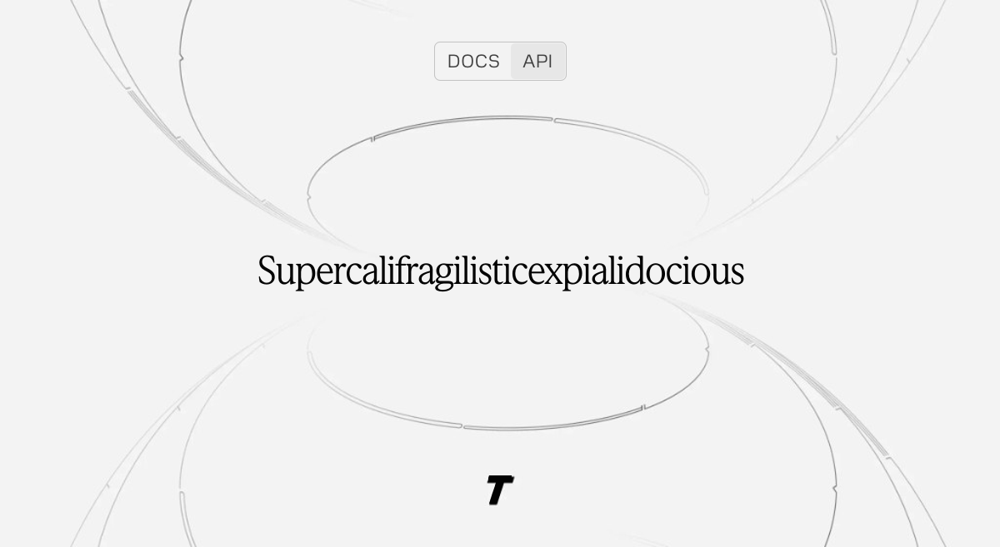

# OG image goldens

These fixtures show representative output from the dynamic social-image generator. Run
`pnpm og:goldens` after an intentional visual change, then review the PNG diff before
committing it. Run `pnpm og:goldens:check` to verify that the renderer still matches the
checked-in fixtures.

| Case | Expected image |
| --- | --- |
| Short title |  |
| Two-line title |  |
| Three-line title |  |
| Section and subsection |  |
| Unicode title |  |
| Long unbreakable title |  |
