# OG image goldens

These fixtures exercise the same WASM response function, fonts, background, request
parameters, and PNG settings as `/api/og`. They also guard `public/og-docs.png`.

Run `pnpm og:goldens:check` to compare every image byte for byte with its checked-in
fixture. A changed or missing image fails the check. Both commands write an expected
and actual image gallery to `test-results/og-goldens/index.html`; no server is needed.
The Verify workflow runs the check and uploads the `og-image-goldens` artifact on
success or failure. Download it and open `index.html` to review the cards side by side.

After an intentional visual change, run `pnpm og:goldens`, inspect every image in the
gallery and the PNG diff, then commit the approved fixtures. Bump `OG_IMAGE_VERSION`
and its inline copy in `vocs.config.ts` when changing the public image design so
crawlers receive fresh cards. Never regenerate fixtures just to silence a failure.

| Case | Expected image |
| --- | --- |
| Docs landing | 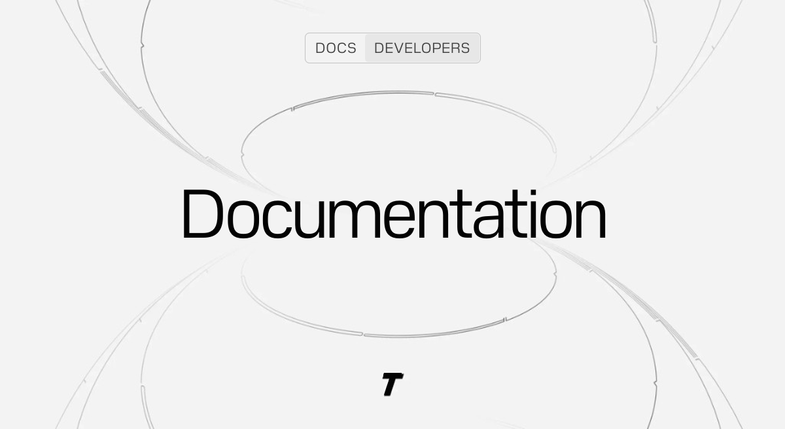 |
| Supported routes (reported regression) | 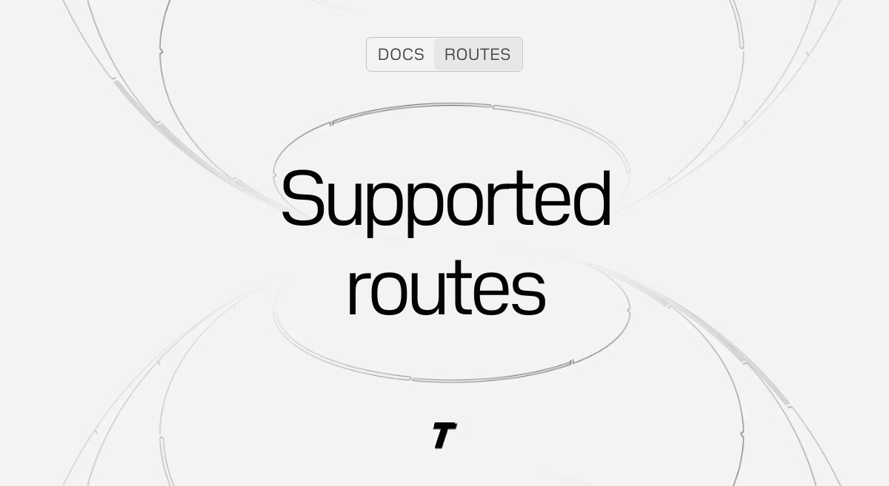 |
| No section | 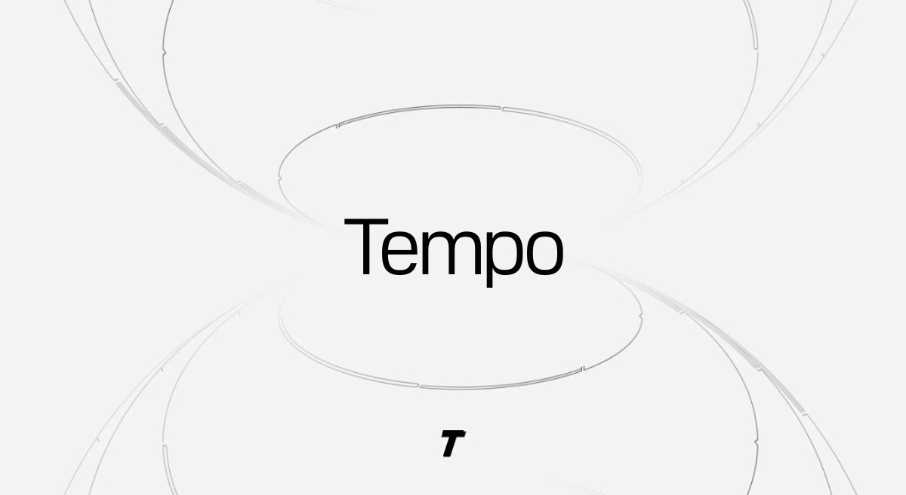 |
| Long product label | 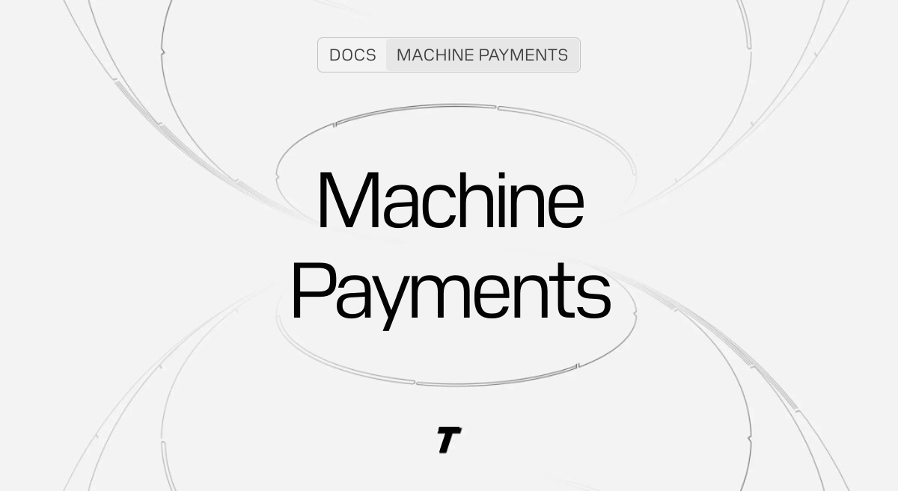 |
| Short title | 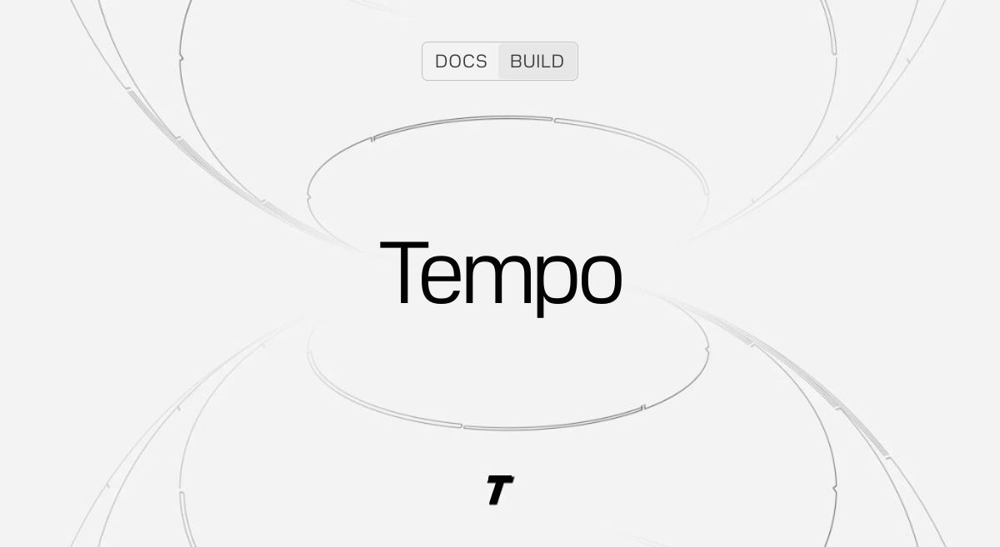 |
| Blog index | 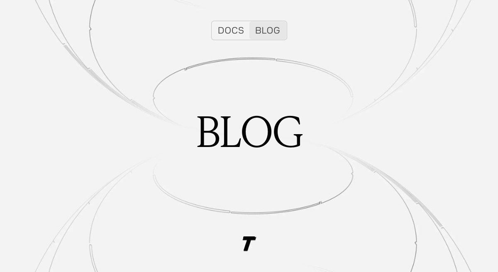 |
| Two-line title | 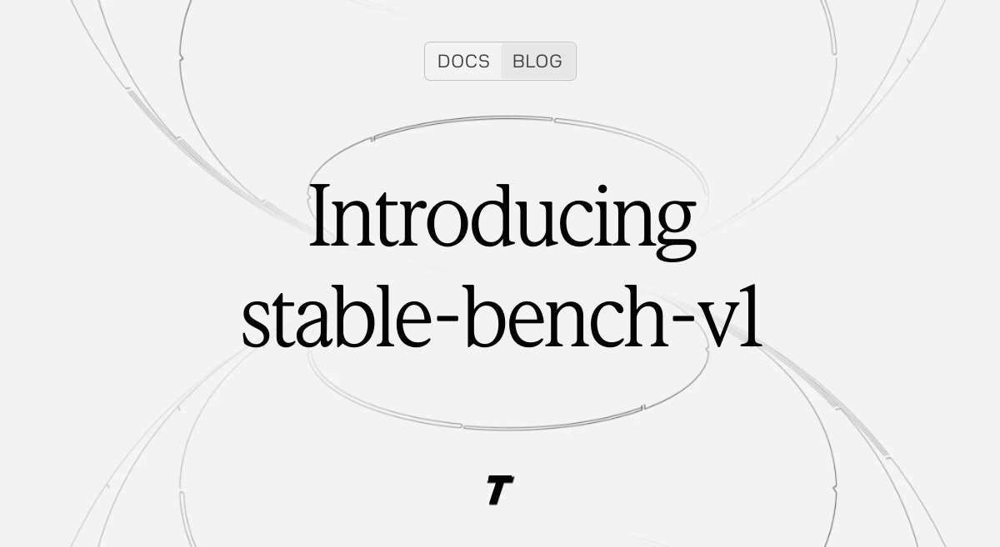 |
| Three-line title | 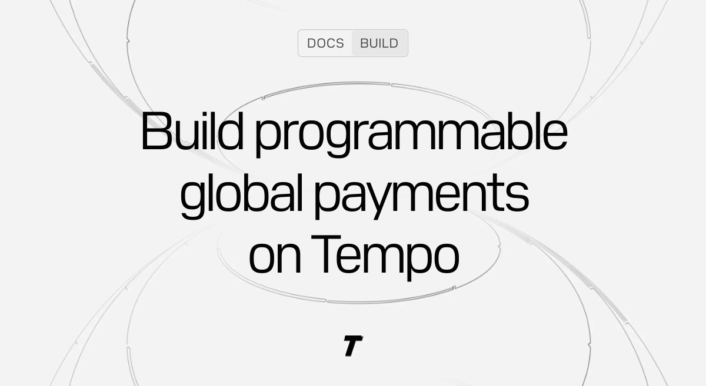 |
| Section and subsection | 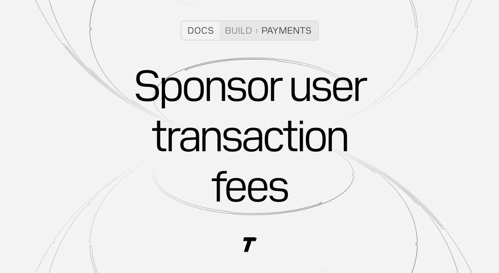 |
| Unicode title | 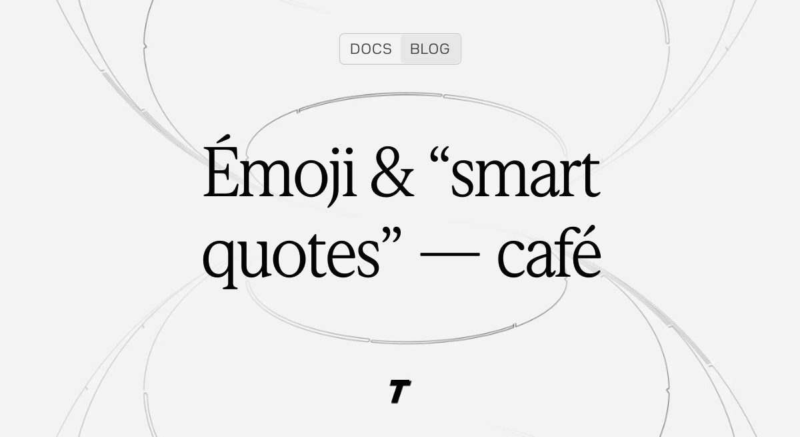 |
| Long unbreakable title | 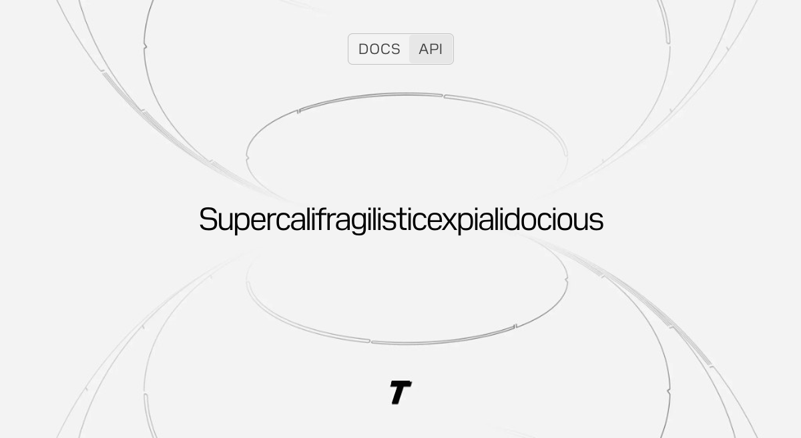 |
