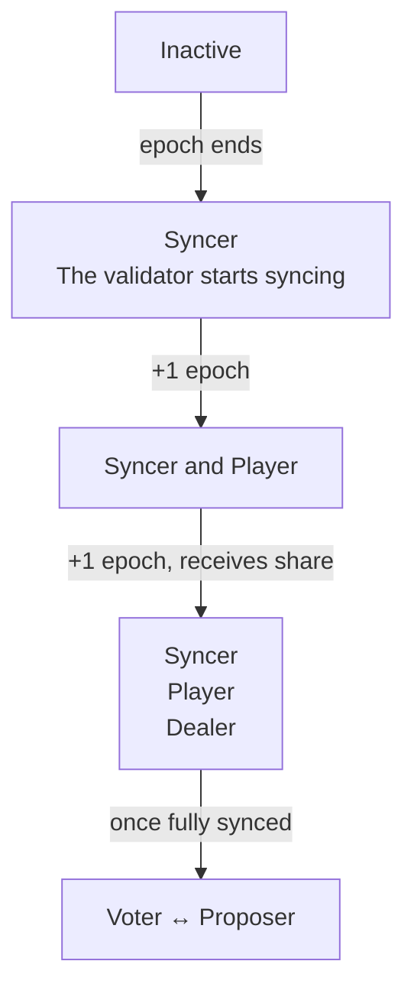

# Operate your validator

This guide covers day-to-day operations for running a Tempo validator in production.

## Validator states

Your validator moves through different states during operation. The transitions will happen only once on your validator's creation. Every state transition will happen on epoch boundaries in the happy case.



Currently, on mainnet and testnet, the epoch length is around 3 hours, which means that your validator will transition through these states approximately every 3 hours. If the epoch length ever changes, the transition times will also change.

#### Not a participant (E)

Epoch E marks the addition of your validator to the on-chain validator configuration smart contract. Your validator isn't considered a peer by validators yet. This is because the validator hasn't been refreshed in the current epoch yet. It is normal that no height metrics progress during this period, your node has to be considered
a syncer to receive blocks.

#### Syncer (epoch E+1)

Your validator is now considered a peer by validators. It's syncing with the network and will be considered a player in the next epoch.

#### Player (epoch E+2)

Your validator is receiving consensus signing shares from dealers during the ceremony.

#### Dealer (epoch E+3)

Your validator is distributing consensus signing shares to other validators during the ceremony. Once your node is fully synced up, it will also
be able to propose blocks and vote for other validators' proposed blocks.

#### Checking your validator's state

Monitor these metrics to track your validator's state:

```bash
# Is your validator connected to other peers (i.e. is it considered a syncer)? This should be >0 in at most 3 hours after your validator's addition
curl -s localhost:8002/metrics | grep consensus_network_spawner_connections

# How many times YOUR node has been a dealer (distributing shares) - this metric should be >0 over 6 hours
curl -s localhost:8002/metrics | grep consensus_engine_dkg_manager_how_often_dealer

# How many times YOUR node has been a player (receiving shares) - this metric should be >0 over 6 hours
curl -s localhost:8002/metrics | grep consensus_engine_dkg_manager_how_often_player

# Successful ceremonies (should increase every ~3 hours)
curl -s localhost:8002/metrics | grep consensus_engine_dkg_manager_ceremony_successes_total

# Failed ceremonies (should stay at 0 or increase rarely)
curl -s localhost:8002/metrics | grep consensus_engine_dkg_manager_ceremony_failures_total
```

If `how_often_dealer` or `how_often_player` is increasing, your node is actively participating in DKG ceremonies. After your validator has been added to the network, you should alert on these metrics, as they indicate that your validator is actively participating in the network.

If your validator is not connected to other peers, but at least 3 epochs have passed, please check that your node is properly configured - e.g. firewall settings are open to other peers. If you have reset your validator's state,
your validator might've been blocked due to double-signing a block. In that case, please reach out to the Tempo team.

### Consensus

#### Proposer

Your validator is currently the leader and proposing blocks. Check proposal activity:
```bash
# Number of blocks your node has built and resolved
curl -s localhost:8002/metrics | grep reth_payloads_resolved_block
```

If this counter is increasing, your validator is actively proposing blocks.

#### Voter

Your validator is voting on blocks proposed by others (notarization and finalization). This is the most common state.

```bash
# Inbound voting messages (should increase steadily)
curl -s localhost:8002/metrics | grep consensus_engine_consensus_voter_inbound_messages_total | grep data_0
```

This counter should increase steadily when your node is participating in consensus.

### Execution

#### Catching up

Your node is syncing historical blocks.

```bash
# Check sync stage
curl -s localhost:8002/metrics | grep reth_sync_checkpoint
```

If `reth_sync_checkpoint` shows stages other than `Finish`, you're still syncing.

#### Up to sync

Your node is fully synced and processing new blocks in real-time.

```bash
# Processed height should match or be close to finalized height
curl -s localhost:8002/metrics | grep -E "marshal_finalized_height|marshal_processed_height"
```

Both values should be nearly equal and increasing together.

## Node Lifecycle

### Starting and Stopping

Use `SIGINT` (Ctrl+C) or `SIGTERM` to gracefully stop the node:

```bash
# If running directly
kill -INT <pid>

# If running via systemd
sudo systemctl stop tempo
```

The node will finish processing the current block before shutting down. Avoid using `SIGKILL` as it may corrupt the database.

### Resetting your validator's data

:::danger
**You cannot reset a validator's data and continue with the same identity.** Doing so risks inconsistent voting, which can cause irrecoverable network safety failures.
:::

If you need to reset your validator's data, you must rotate to a new validator identity. This requires coordinating with the Tempo team to deactivate your old identity and register a new one.

## Key Management

### Signing Key Rotation

To rotate your validator's signing key:

1. Generate a new keypair:

```bash
tempo consensus generate-private-key --output <new-key-path>
tempo consensus calculate-public-key --private-key <new-key-path>
```

2. Contact the Tempo team to update your validator's public key on-chain

3. Once confirmed, update your node configuration to use the new key and restart. Once the node is running, your validator will go through the [validator lifecycle](/guide/node/operate-validator#validator-states).

:::warning
The old validator identity must be deactivated before the new one is activated
:::

### Signing Share Recovery

:::danger
**You cannot reset a validator's data and continue with the same identity.** Doing so risks inconsistent voting, which can cause irrecoverable network safety failures. 
:::

If you lose your signing share (stored on the database in `<datadir>/consensus/`), you will need to rotate to a new validator identity. This requires coordinating with the Tempo team to deactivate your old identity and register a new one.
We're planning to release a high-availability feature that allows storing consensus data in an external database, which will enable signing share recovery without the need for key rotation.

## Log Management

### Parsing Logs

Tempo logs include ANSI escape codes for colors. To strip them for grep/awk:

```bash
# Strip colors when searching
sudo journalctl -u tempo | sed 's/\x1b\[[0-9;]*m//g' | grep "error"

# Or disable colors at runtime
RUST_LOG_STYLE=never tempo node ...
```

If you're using Loki, you can also use the `decolorize` filter to strip colors:

```text
{job="tempo-node"} | decolorize
```

### Log Levels

Control verbosity with `RUST_LOG`:

```bash
# Default (info)
RUST_LOG=info

# Debug consensus only
RUST_LOG=info,tempo_commonware_node::consensus=debug

# Quiet mode (warnings and errors only)
RUST_LOG=warn
```

## Metrics glossary

This is a table of the most important metrics to watch on your validator node:

| Metric Name | Description | When to alert? | Meaning |
| --- | --- | --- | --- |
| `consensus_engine_dkg_manager_ceremony_successes_total` | Number of successful DKG ceremonies | Critical when it hasn't increased in 12 hours | Your node has participated in a successful DKG ceremony |
| `consensus_engine_dkg_manager_ceremony_failures_total` | Number of failed DKG ceremonies | Warning when it increases | Your node has failed to participate in a DKG ceremony |
| `consensus_engine_marshal_finalized_height` | Latest finalized height your node is aware of | Warning when it hasn't increased in 1 hour, critical when it hasn't increased in 3 hours | Your node is aware of the latest finalized height |
| `consensus_engine_marshal_processed_height` | Latest height your node has processed | Critical when it hasn't increased in an hour, warning when it's behind finalized height | Your node is processing blocks |
| `consensus_network_spawner_connections` | Number of active peers on the consensus layer | Warning when it's below the expected validator count, critical when it's 0 | Your node is connected to the consensus layer |
| `consensus_engine_epoch_manager_simplex_batcher_inbound_messages_total` | Number of inbound messages related to voting on the consensus layer | Warning when it's not increasing and your node is synced | Your node is receiving voting messages from the consensus layer |
| `reth_sync_checkpoint` | Current sync progress | Warning on when there are no changes in the `Finish` stage | Your node is syncing with the network |
| `reth_payloads_resolved_block` | Number of built and resolved payloads | Warning when it hasn't increased in 12 hours | Your node has built and resolved blocks |

## Grafana Dashboard

We provide a pre-built Grafana dashboard for monitoring your validator. It visualizes key metrics including node status, sync progress, voting activity, consensus latency, and execution performance.

### Importing the dashboard

1. Download the dashboard JSON from the [Tempo repository](https://github.com/tempoxyz/tempo/blob/main/contrib/grafana/dashboards/validator-health.json)

2. In Grafana, go to **Dashboards → Import**

3. Either paste the JSON content or upload the file

4. Select your Prometheus and Loki datasources when prompted

5. Click **Import**

### Dashboard variables

The dashboard uses these template variables:

| Variable | Description |
| --- | --- |
| `datasource` | Prometheus datasource |
| `loki_ds` | Loki datasource (for log-based panels) |
| `network_name` | Filter by network/validator job name |

Make sure your Prometheus is scraping metrics from your validator's metrics endpoint (default: `localhost:8002/metrics`).
