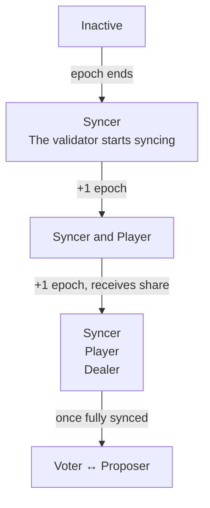

# ValidatorConfig V1 (Legacy)

:::warning
This page documents ValidatorConfig V1 behavior, which applies **before the T2 hardfork**. Once T2 is active, use [ValidatorConfig V2](/guide/node/validator-config-v2) instead.
:::

ValidatorConfig V1 is the original precompile for managing consensus participants. All management operations are permissioned and require coordinating with the Tempo team.

## Validator states

Under V1, your validator goes through the following states after being added on-chain. Each transition happens on epoch boundaries.



Currently, on mainnet and testnet, the epoch length is around 3 hours, which means that your validator will transition through these states approximately every 3 hours.

#### Not a participant (E)

Epoch E marks the addition of your validator to the on-chain validator configuration smart contract. Your validator isn't considered a peer by validators yet. This is because the validator hasn't been refreshed in the current epoch yet. It is normal that no height metrics progress during this period, your node has to be considered a syncer to receive blocks.

#### Syncer (epoch E+1)

Your validator is now considered a peer by validators. It's syncing with the network and will be considered a player in the next epoch.

#### Player (epoch E+2)

Your validator is receiving consensus signing shares from dealers during the ceremony.

#### Dealer (epoch E+3)

Your validator is distributing consensus signing shares to other validators during the ceremony. Once your node is fully synced up, it will also be able to propose blocks and vote for other validators' proposed blocks.

## Key Management

### Signing Key Rotation

1. Generate a new keypair:

```bash
tempo consensus generate-private-key --output <new-key-path>
tempo consensus calculate-public-key --private-key <new-key-path>
```

2. Contact the Tempo team to update your validator's public key on-chain

3. Once confirmed, update your node configuration to use the new key and restart. Once the node is running, your validator will go through the [validator states](#validator-states) again.

:::warning
The old validator identity must be deactivated before the new one is activated.
:::

### Signing Share Recovery

If you lose your signing share, coordinate with the Tempo team to deactivate your old identity and register a new one.

### Update IP Addresses

Contact the Tempo team to update your validator's ingress and egress addresses on-chain.
