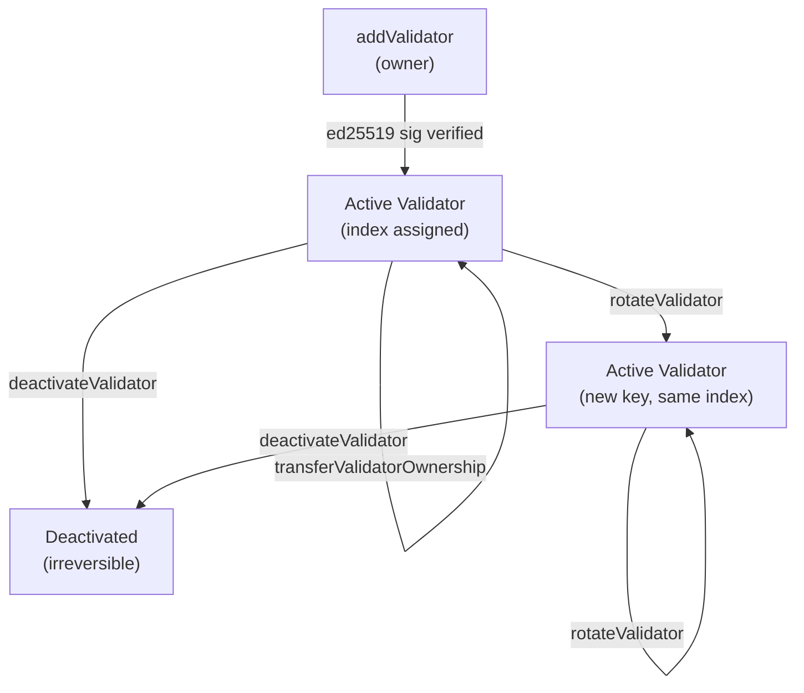

# ValidatorConfig V2

ValidatorConfig V2 ([TIP-1017](/protocol/tips/tip-1017)) is a new precompile for managing consensus participants. It replaces the original ValidatorConfig with stronger safety guarantees: ed25519 signature verification at registration, append-only history, and self-service operations for validators.

## Validator lifecycle



Once added, a validator is **active** and can be rotated, have its IP addresses updated, or have its ownership transferred — all without leaving the committee. Deactivation is irreversible; the entry stays in history but the public key is reserved forever.

## What changes for operators

With V2, validators can perform several operations themselves without coordinating with the Tempo team:

- **Rotate your validator identity** — swap to a new ed25519 key without losing your committee slot
- **Update IP addresses** — change ingress/egress endpoints on the fly
- **Transfer ownership** — rebind your validator entry to a new address
- **Fee recipient separation** — will be enabled in a future hardfork. For now, continue using `--consensus.fee-recipient` when starting your node.

All write operations require either the contract owner or the validator's own address.

## Precompile address

```solidity
address constant VALIDATOR_CONFIG_V2 = 0xCCCCCCCC00000000000000000000000000000001;
```

## Reading validator state

### Query active validators

```bash
cast call 0xCCCCCCCC00000000000000000000000000000001 \
  "getActiveValidators()" \
  --rpc-url https://rpc.tempo.xyz
```

### Look up your validator

You can query your validator by address, public key, or index:

```bash
# By address
cast call 0xCCCCCCCC00000000000000000000000000000001 \
  "validatorByAddress(address)(bytes32,address,string,string,uint64,uint64,uint64,address)" \
  <YOUR_VALIDATOR_ADDRESS> \
  --rpc-url https://rpc.tempo.xyz

# By public key
cast call 0xCCCCCCCC00000000000000000000000000000001 \
  "validatorByPublicKey(bytes32)(bytes32,address,string,string,uint64,uint64,uint64,address)" \
  <YOUR_PUBLIC_KEY> \
  --rpc-url https://rpc.tempo.xyz

# By index
cast call 0xCCCCCCCC00000000000000000000000000000001 \
  "validatorByIndex(uint64)(bytes32,address,string,string,uint64,uint64,uint64,address)" \
  <INDEX> \
  --rpc-url https://rpc.tempo.xyz
```

The returned `Validator` struct fields are:

| Field | Type | Description |
|-------|------|-------------|
| `publicKey` | `bytes32` | Ed25519 communication public key |
| `validatorAddress` | `address` | Validator control address |
| `ingress` | `string` | Inbound address (`IP:port`) |
| `egress` | `string` | Outbound address (`IP`) |
| `index` | `uint64` | Immutable array position |
| `addedAtHeight` | `uint64` | Block height when added |
| `deactivatedAtHeight` | `uint64` | Block height when deactivated (`0` = active) |
| `feeRecipient` | `address` | Address that receives block proposal fees |

## Operator guide

### Update IP addresses

If your node's network endpoints change, update them on-chain. The change takes effect at the next finalized block.

```bash
cast send 0xCCCCCCCC00000000000000000000000000000001 \
  "setIpAddresses(uint64,string,string)" \
  <YOUR_VALIDATOR_INDEX> \
  "<NEW_IP>:<NEW_PORT>" \
  "<NEW_EGRESS_IP>" \
  --rpc-url https://rpc.tempo.xyz \
  --private-key <YOUR_VALIDATOR_PRIVATE_KEY>
```

:::warning
Ingress addresses must be unique across all active validators. The transaction will revert if another active validator already uses the same `IP:port`.
:::

### Rotate validator identity

V2 lets you rotate to a new ed25519 key while keeping your validator index stable. This is useful for key rotation or recovery without leaving and re-joining the committee.

Rotation requires an ed25519 signature from the **new** key proving ownership. The signature is computed over a domain-separated message containing:

```
rotateValidatorMessage = keccak256(
    chainId || contractAddress || validatorAddress ||
    len(ingress) || ingress || len(egress) || egress
)
```

signed with namespace `b"TEMPO_VALIDATOR_CONFIG_V2_ROTATE_VALIDATOR"`.

```bash
cast send 0xCCCCCCCC00000000000000000000000000000001 \
  "rotateValidator(uint64,bytes32,string,string,bytes)" \
  <YOUR_VALIDATOR_INDEX> \
  <NEW_PUBLIC_KEY> \
  "<NEW_INGRESS_IP>:<PORT>" \
  "<NEW_EGRESS_IP>" \
  <ED25519_SIGNATURE> \
  --rpc-url https://rpc.tempo.xyz \
  --private-key <YOUR_VALIDATOR_PRIVATE_KEY>
```

:::info
Rotation preserves your validator index and active validator count. The old entry is appended to history as deactivated, and the entry at your index is updated in place. You must use a different ingress address (changing the port is sufficient).
:::

After rotation, your validator goes through the [standard lifecycle](/guide/node/operate-validator#validator-states) with the new identity.

### Transfer validator ownership

Rebind your validator entry to a new control address:

```bash
cast send 0xCCCCCCCC00000000000000000000000000000001 \
  "transferValidatorOwnership(uint64,address)" \
  <YOUR_VALIDATOR_INDEX> \
  <NEW_ADDRESS> \
  --rpc-url https://rpc.tempo.xyz \
  --private-key <YOUR_VALIDATOR_PRIVATE_KEY>
```

The new address must not already be used by another active validator.

## Differences from V1

| | V1 | V2 |
|---|---|---|
| **Key ownership** | No verification | Ed25519 signature required |
| **History** | Mutable, toggle active/inactive | Append-only, deactivate-once |
| **Validator index** | Could change | Stable for lifetime |
| **Self-service ops** | None (owner only) | IP updates, rotation, transfer |
| **Historical queries** | Required warmup state, bloated snapshots | `addedAtHeight` / `deactivatedAtHeight` fields |

## Migration from V1

Migration happens incrementally — one validator at a time — to avoid out-of-gas issues. During migration, the consensus layer continues reading from V1.

1. The contract owner calls `migrateValidator(idx)` for each V1 validator index (in descending order)
2. After all indices are processed, the owner calls `initializeIfMigrated()`
3. Once initialized, the consensus layer switches reads to V2

:::warning
Migration and `initializeIfMigrated()` should complete before an epoch boundary to avoid DKG disruption. Admins should verify V1/V2 state consistency before finalizing.
:::

### What happens during migration

| Phase | Consensus reads from | Allowed V2 calls |
|-------|---------------------|-------------------|
| Pre-init (migration) | V1 | `migrateValidator`, `deactivateValidator`, `initializeIfMigrated` |
| Post-init | V2 | All operations except `migrateValidator` |

## Consensus integration

- **IP changes** take effect at the next finalized block
- **Added validators** join the DKG player set at the next epoch — no warmup period
- **Deactivated validators** leave at the next epoch — no cooldown period

### DKG player selection

The consensus layer determines DKG players for epoch `E+1` by reading state at `boundary(E) - 1`:

```
players(E+1) = validators.filter(v =>
    v.addedAtHeight < boundary(E) &&
    (v.deactivatedAtHeight == 0 || v.deactivatedAtHeight >= boundary(E))
)
```
