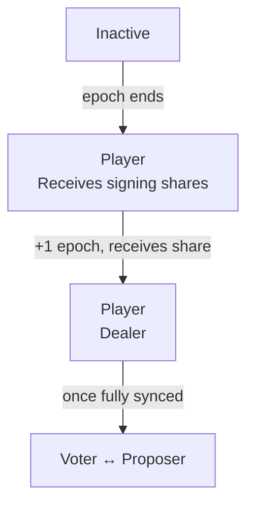

# ValidatorConfig V2

ValidatorConfig V2 ([TIP-1017](/protocol/tips/tip-1017)) is a new precompile for managing consensus participants. It replaces the original ValidatorConfig with stronger safety guarantees: ed25519 signature verification at registration, append-only history, and self-service operations for validators. V2 becomes available after the T2 hardfork once migration is complete — [check if V2 is active](#check-if-v2-is-active) to confirm.

## Validator states

With V2, the syncer warmup phase from V1 is removed. Once added, a validator immediately becomes a player in the next epoch.



Compare this to the [V1 validator states](/guide/node/validator-config-v1#validator-states), which required an additional syncer epoch before becoming a player.

## What changes for operators

With V2, validators can perform several operations themselves without coordinating with the Tempo team:

- **Rotate your validator identity** — swap to a new ed25519 key without losing your committee slot
- **Update IP addresses** — change ingress and egress endpoints independently (V2 supports asymmetric ingress/egress IPs)
- **Transfer ownership** — rebind your validator entry to a new address
- **Fee recipient separation** — will be enabled in a future hardfork. For now, continue using `--consensus.fee-recipient` when starting your node.

All write operations require either the contract owner or the validator's own address.

## Precompile address

```solidity
address constant VALIDATOR_CONFIG_V2 = 0xCCCCCCCC00000000000000000000000000000001;
```

## Check if V2 is active

After the T2 hardfork, the contract owner migrates validators from V1 to V2. Use these calls to check if migration is complete and V2 is active:

```bash
# Returns true once migration is complete and V2 is the active config
cast call 0xCCCCCCCC00000000000000000000000000000001 \
  "isInitialized()(bool)" \
  --rpc-url https://rpc.tempo.xyz

# Returns the block height at which V2 was initialized (0 if not yet initialized)
cast call 0xCCCCCCCC00000000000000000000000000000001 \
  "getInitializedAtHeight()(uint64)" \
  --rpc-url https://rpc.tempo.xyz
```

If `isInitialized()` returns `true`, V2 is active and all operations on this page are available. If it returns `false`, the network is still on [ValidatorConfig V1](/guide/node/validator-config-v1).

## Reading validator state

### Query active validators

```bash
cast call 0xCCCCCCCC00000000000000000000000000000001 \
  "getActiveValidators()" \
  --rpc-url https://rpc.tempo.xyz
```

### Look up your validator

You can query your validator by address, public key, or index:

```bash
# By address
cast call 0xCCCCCCCC00000000000000000000000000000001 \
  "validatorByAddress(address)(bytes32,address,string,string,uint64,uint64,uint64,address)" \
  <YOUR_VALIDATOR_ADDRESS> \
  --rpc-url https://rpc.tempo.xyz

# By public key
cast call 0xCCCCCCCC00000000000000000000000000000001 \
  "validatorByPublicKey(bytes32)(bytes32,address,string,string,uint64,uint64,uint64,address)" \
  <YOUR_PUBLIC_KEY> \
  --rpc-url https://rpc.tempo.xyz

# By index
cast call 0xCCCCCCCC00000000000000000000000000000001 \
  "validatorByIndex(uint64)(bytes32,address,string,string,uint64,uint64,uint64,address)" \
  <INDEX> \
  --rpc-url https://rpc.tempo.xyz
```

The returned `Validator` struct fields are:

| Field | Type | Description |
|-------|------|-------------|
| `publicKey` | `bytes32` | Ed25519 communication public key |
| `validatorAddress` | `address` | Validator control address |
| `ingress` | `string` | Inbound address (`IP:port`) |
| `egress` | `string` | Outbound address (`IP`) |
| `index` | `uint64` | Immutable array position |
| `addedAtHeight` | `uint64` | Block height when added |
| `deactivatedAtHeight` | `uint64` | Block height when deactivated (`0` = active) |
| `feeRecipient` | `address` | Address that receives block proposal fees |

## Operator guide

### Update IP addresses

If your node's network endpoints change, update them on-chain. The change takes effect at the next finalized block.

Unlike V1, V2 supports asymmetric ingress and egress IPs — they no longer need to share the same address. If you only want to update one, pass the current value for the other.

```bash
cast send 0xCCCCCCCC00000000000000000000000000000001 \
  "setIpAddresses(uint64,string,string)" \
  <YOUR_VALIDATOR_INDEX> \
  "<NEW_IP>:<NEW_PORT>" \
  "<NEW_EGRESS_IP>" \
  --rpc-url https://rpc.tempo.xyz \
  --private-key <YOUR_VALIDATOR_PRIVATE_KEY>
```

`<NEW_IP>:<NEW_PORT>` and `<NEW_EGRESS_IP>` may remain unchanged if you only need to update one of the two.

:::warning
Ingress addresses must be unique across all active validators. The transaction will revert if another active validator already uses the same `IP:port`.
:::

### Rotate validator identity

V2 lets you rotate to a new ed25519 key while keeping your validator index stable. This is useful for key rotation or recovery without leaving and re-joining the committee.

The simplest way to rotate is using the `tempo` CLI, which handles signature creation and the on-chain transaction in one step:

```bash
tempo consensus rotate-validator \
  --signing-key <NEW_PRIVATE_KEY_PATH> \
  --rpc-url https://rpc.tempo.xyz
```

:::info
Rotation preserves your validator index and active validator count. The old entry is appended to history as deactivated, and the entry at your index is updated in place. You must use a different ingress address (changing the port is sufficient).
:::

After rotation, your validator goes through the [standard lifecycle](#validator-states) with the new identity.

:::danger[Do not shut down the old validator immediately]
After rotation, the rotated-out validator is still a member of the current committee until the next successful DKG ceremony completes. Shutting it down early will degrade network liveness.

Keep the old validator running and use `validators-info` to monitor its status:

```bash
tempo consensus validators-info --rpc-url https://rpc.tempo.xyz
```

Once the old validator shows `in_committee = false`, it is safe to shut down.
:::

#### Using raw contract calls

If you prefer to call the precompile directly, first generate the required ed25519 signature proving ownership of the new key:

```bash
tempo consensus create-rotate-validator-signature \
  --signing-key <NEW_PRIVATE_KEY_PATH> \
  --rpc-url https://rpc.tempo.xyz
```

Then use the output signature in a `rotateValidator` call via `cast send`.

#### Initial registration

When registering a new validator, generate the add-validator signature and provide it to the Tempo team:

```bash
tempo consensus create-add-validator-signature \
  --signing-key <PRIVATE_KEY_PATH> \
  --rpc-url https://rpc.tempo.xyz
```

### Transfer validator ownership

Rebind your validator entry to a new control address:

```bash
cast send 0xCCCCCCCC00000000000000000000000000000001 \
  "transferValidatorOwnership(uint64,address)" \
  <YOUR_VALIDATOR_INDEX> \
  <NEW_ADDRESS> \
  --rpc-url https://rpc.tempo.xyz \
  --private-key <YOUR_VALIDATOR_PRIVATE_KEY>
```

The new address must not already be used by another active validator.

## Differences from V1

| | V1 | V2 |
|---|---|---|
| **Key ownership** | No verification | Ed25519 signature required |
| **History** | Mutable, toggle active/inactive | Append-only, deactivate-once |
| **Validator index** | Could change | Stable for lifetime |
| **Self-service ops** | None (owner only) | IP updates, rotation, transfer |
| **Historical queries** | Required warmup state, bloated snapshots | `addedAtHeight` / `deactivatedAtHeight` fields |


