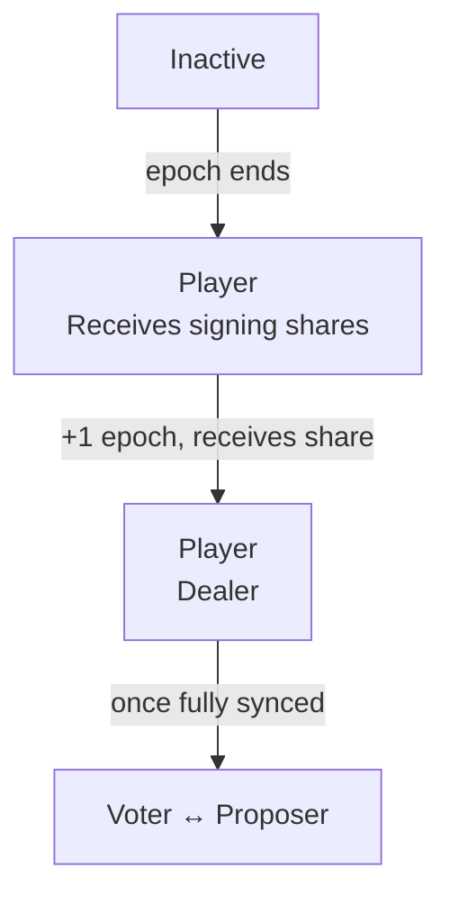

# ValidatorConfig V2

ValidatorConfig V2 ([TIP-1017](/protocol/tips/tip-1017)) is a new precompile for managing consensus participants. It replaces the original ValidatorConfig with stronger safety guarantees: ed25519 signature verification at registration, append-only history, and self-service operations for validators.

V2 was [activated on mainnet](https://explore.mainnet.tempo.xyz/receipt/0x4716147e3c2bf5c8d014b8c27d6e2af0042d5a5f29bdead256d6f33038702d64) as part of the T2 hardfork.

## Validator states

With V2, the syncer warmup phase from V1 is removed. Once added, a validator immediately becomes a player in the next epoch.



Compare this to the [V1 validator states](/guide/node/validator-config-v1#validator-states), which required an additional syncer epoch before becoming a player.

## What changes for operators

With V2, validators can perform several operations themselves without coordinating with the Tempo team:

- **Rotate your validator identity** — swap to a new ed25519 key without losing your committee slot
- **Update IP addresses** — change ingress and egress endpoints independently (V2 supports asymmetric ingress/egress IPs)
- **Transfer ownership** — rebind your validator entry to a new address

All write operations require either the contract owner or the validator's own address.

## Precompile address

```solidity
address constant VALIDATOR_CONFIG_V2 = 0xCCCCCCCC00000000000000000000000000000001;
```

## Reading validator state

### Query active validators

Use `validators-info` to see the current state of all validators:

```bash
tempo consensus validators-info --rpc-url https://rpc.tempo.xyz
```

This returns the committee of the current epoch (validators with `in_committee = true`) as well as validators that have been added but will only become active in a future epoch. Use this to verify your validator's status after registration or rotation.

:::info
The on-chain contract represents which validators should eventually be members of the committee, not which ones currently are. Every epoch, the Tempo network performs a distributed key generation ceremony, distributing keys to validators that should be
committee members in the next epoch. So adding, deactivating, or rotating validators entries in epoch `E` can only be taken into account for the next DKG ceremony that runs during epoch `E+1`, and take effect in epoch `E+2`.
:::

### Look up your validator

You can query your validator by ethereum address, ed25519 public key, or index:

```bash
tempo consensus validator <address/public_key/index> --rpc-url https://rpc.tempo.xyz
```

The returned `Validator` struct fields are:

| Field | Type | Description |
|-------|------|-------------|
| `publicKey` | `bytes32` | Ed25519 communication public key |
| `validatorAddress` | `address` | Validator control address |
| `ingress` | `string` | Inbound address (`IP:port`) |
| `egress` | `string` | Outbound address (`IP`) |
| `index` | `uint64` | Index of the validator (constant under rotation)|
| `addedAtHeight` | `uint64` | Block height when added |
| `deactivatedAtHeight` | `uint64` | Block height when deactivated (`0` = active) |
| `feeRecipient` | `address` | Address that receives block proposal fees |

## Operator guide

### Initial registration

To register a new validator, you must provide the following values to the Tempo team:

| Value | Format | Description |
|-------|--------|-------------|
| **Validator address** | Ethereum address (`0x…`) | The control address for your validator. Used to authorize on-chain operations (IP updates, rotation, ownership transfer). |
| **Public key** | `0x`-prefixed 32-byte hex | Your ed25519 identity key. Generate one with `tempo consensus generate-private-key` (see [below](#generating-a-signing-key)). |
| **Ingress** | `IP:port` | The inbound address other validators use to reach your node. Must be unique across all active validators. |
| **Egress** | `IP` | The outbound IP address your node uses to connect to other validators. |
| **Fee recipient** | Ethereum address (`0x…`) | The address that receives transaction fees from blocks your validator proposes. If you are not prepared to accept fees, use `0x0000000000000000000000000000000000000000`. |
| **Signature** | `0x`-prefixed hex | An ed25519 signature proving you control the signing key. See below. |

#### Generating a signing key

:::warning
Never share your private signing key. Anyone with access to it can impersonate your validator.
:::

Generate an ed25519 keypair:

```bash
tempo consensus generate-private-key --output <path>
```

Verify the public key:

```bash
tempo consensus calculate-public-key --private-key <path>
```

The public key should match the output of the `generate-private-key` command.

#### Creating the add-validator signature

The signature proves ownership of the ed25519 key being registered. Generate it with:

```bash
tempo consensus create-add-validator-signature \
  --signing-key <PRIVATE_KEY_PATH> \
  --validator-address <YOUR_VALIDATOR_ADDRESS> \
  --public-key <YOUR_PUBLIC_KEY> \
  --ingress <IP:PORT> \
  --egress <IP> \
  --fee-recipient <FEE_RECIPIENT_ADDRESS> \
  --chain-id-from-rpc-url https://rpc.tempo.xyz
```

This outputs a hex-encoded signature. Provide this signature along with the values above to the Tempo team to complete registration.

Once the Tempo team adds your validator on-chain, it will enter the active set in the [next epoch](#validator-states).

### Update the Fee Recipient

The fee recipient used by your validator when constructing block proposals is managed on-chain. This can be updated and takes effect on the next finalized block

```bash
tempo consensus set-validator-fee-recipient <address/pubkey/index>
  --fee-recipient <ETHEREUM_ADDRESS>
  --rpc-url https://rpc.tempo.xyz
  --private-key <PATH_TO_VALIDATOR_PRIVATE_KEY>
```
### Update IP addresses

If your node's network endpoints change, update them on-chain. The change takes effect at the next finalized block.

Unlike V1, V2 supports asymmetric ingress and egress IPs — they no longer need to share the same address. Both can be updated together or individually by supplying only `--ingress` or `--egress`. The values not supplied will pulled from the chain and left unchanged in the submitted transaction.

```bash
tempo consensus set-validator-ip-address <address/pubkey/index>
  --ingress <NEW_IP>:NEW_PROT>
  --egress <NEW_IP>
  --rpc-url https://rpc.tempo.xyz
  --private-key <PATH_TO_VALIDATOR_PRIVATE_KEY>
```

:::warning
Ingress addresses must be unique across all active validators. The transaction will revert if another active validator already uses the same `IP:port`.
:::

### Rotate validator identity

V2 lets you rotate to a new ed25519 key while keeping your validator index stable. This is useful for key rotation or recovery without leaving and re-joining the committee. [Generate a new signing key](#generating-a-signing-key) first.

The simplest way to rotate is using the `tempo` CLI, which handles signature creation and the on-chain transaction in one step:

```bash
tempo consensus rotate-validator \
  --validator-address <YOUR_VALIDATOR_ADDRESS> \
  --public-key <NEW_PUBLIC_KEY> \
  --ingress <NEW_IP:PORT> \
  --egress <NEW_IP> \
  --signing-key <NEW_PRIVATE_KEY_PATH> \
  --private-key <ETHEREUM_PRIVATE_KEY_PATH> \
  --rpc-url https://rpc.tempo.xyz
```

If self-service rotation is not yet enabled for your validator, use `tempo consensus create-rotate-validator-signature` to generate the signature and provide it to the Tempo team.

:::info
Rotation preserves your validator index and active validator count. The old entry is appended to history as deactivated, and the entry at your index is updated in place. You must use a different ingress address (changing the port is sufficient).
:::

After rotation, your validator goes through the [standard lifecycle](#validator-states) with the new identity.

:::danger[Do not shut down the old validator immediately]
After rotation, the rotated-out validator is still a member of the current committee until the next successful DKG ceremony completes. Shutting it down early will degrade network liveness.

Keep the old validator running and use `validators-info` to monitor its status:

```bash
tempo consensus validators-info --rpc-url https://rpc.tempo.xyz
```

Once the old validator shows `in_committee = false`, it is safe to shut down.
:::

### Transfer validator ownership

Rebind your validator entry to a new control address:

```bash
tempo consensus transfer-validator-ownership <address/pubkey/index>
  --rpc-url https://rpc.tempo.xyz \
  --private-key <PATH_TO_VALIDATOR_PRIVATE_KEY>
  --new-private-key <PATH_TO_NEW_VALIDATOR_PRIVATE_KEY>
```

The new address must not already be used by another active validator.

### Deactivate your validator

Deactivate your validator. Once deactivated, please keep your the node. The validator is only removed from the commitee once reaching the end of an epoch where the DKG was successful, thus the validator is no longer dealt any new shares.

See the [validators-info](#query-active-validators) command which lists active validators. It is safe to shut down the node once the deactivated validator is no longer present in this list.

```bash
tempo consensus deactivate-validator <address/pubkey/index>
  --rpc-url https://rpc.tempo.xyz \
  --private-key <PATH_TO_VALIDATOR_PRIVATE_KEY>
```

## Differences from V1

| | V1 | V2 |
|---|---|---|
| **Key ownership** | No verification | Ed25519 signature required |
| **History** | Mutable, toggle active/inactive | Append-only, deactivate-once |
| **Validator index** | Could change | Stable for lifetime |
| **Self-service ops** | None (owner only) | IP updates, rotation, transfer |
| **Historical queries** | Required warmup state, bloated snapshots | `addedAtHeight` / `deactivatedAtHeight` fields |


