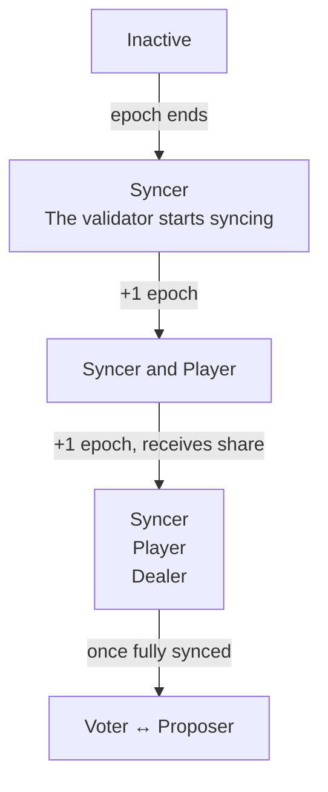

# Checking validator state

Your validator moves through different states after registration. Understanding these states helps you verify that your node is healthy and participating in consensus.

:::danger
**You cannot reset a validator's data and continue with the same identity.** Doing so risks inconsistent voting, which can cause irrecoverable network safety failures. If you need to reset your validator's data, you must rotate to a new validator identity — see [Signing key rotation](/guide/node/validator-keys#signing-key-rotation).
:::

## State transitions

Every state transition happens on epoch boundaries. Currently on mainnet and testnet, the epoch length is around 3 hours.



#### Not a participant (E)

Epoch E marks the addition of your validator to the on-chain validator configuration smart contract. Your validator isn't considered a peer by validators yet. This is because the validator hasn't been refreshed in the current epoch yet. It is normal that no height metrics progress during this period — your node has to be considered a syncer to receive blocks.

#### Syncer (epoch E+1)

Your validator is now considered a peer by validators. It's syncing with the network and will be considered a player in the next epoch.

#### Player (epoch E+2)

Your validator is receiving consensus signing shares from dealers during the ceremony.

#### Dealer (epoch E+3)

Your validator is distributing consensus signing shares to other validators during the ceremony. Once your node is fully synced up, it will also be able to propose blocks and vote for other validators' proposed blocks.

:::info
The on-chain contract represents which validators should eventually be members of the committee, not which ones currently are. Every epoch, the Tempo network performs a distributed key generation ceremony, distributing keys to validators that should be committee members in the next epoch. So adding, deactivating, or rotating validator entries in epoch `E` can only be taken into account for the next DKG ceremony that runs during epoch `E+1`, and take effect in epoch `E+2`.
:::

## Checking state via metrics

Monitor these metrics to track your validator's state:

```bash
# Is your validator connected to other peers (i.e. is it considered a syncer)?
# This should be >0 in at most 3 hours after your validator's addition.
curl -s localhost:8002/metrics | grep consensus_network_spawner_connections

# How many times YOUR node has been a dealer (distributing shares)
# This metric should be >0 over 6 hours.
curl -s localhost:8002/metrics | grep consensus_engine_dkg_manager_how_often_dealer

# How many times YOUR node has been a player (receiving shares)
# This metric should be >0 over 6 hours.
curl -s localhost:8002/metrics | grep consensus_engine_dkg_manager_how_often_player

# Successful ceremonies (should increase every ~3 hours)
curl -s localhost:8002/metrics | grep consensus_engine_dkg_manager_ceremony_successes_total

# Failed ceremonies (should stay at 0 or increase rarely)
curl -s localhost:8002/metrics | grep consensus_engine_dkg_manager_ceremony_failures_total
```

If `how_often_dealer` or `how_often_player` is increasing, your node is actively participating in DKG ceremonies. After your validator has been added to the network, you should alert on these metrics, as they indicate that your validator is actively participating in the network.

If your validator is not connected to other peers, but at least 3 epochs have passed, check that your node is properly configured — e.g. firewall settings are open to other peers. If you have reset your validator's state, your validator might have been blocked due to double-signing a block. In that case, please reach out to the Tempo team — even with the Tempo team, resolving this requires coordinating a new validator identity.

## Querying on-chain state

Check your validator's on-chain status using the CLI:

::::code-group
```bash [Mainnet]
tempo consensus validators-info --rpc-url https://rpc.tempo.xyz
```
```bash [Testnet]
tempo consensus validators-info --rpc-url https://rpc.testnet.tempo.xyz
```
::::

This returns the committee of the current epoch (validators with `in_committee = true`) as well as validators that have been added but will only become active in a future epoch. Use this to verify your validator's status after registration or rotation.

### Look up your validator

You can query your validator by ethereum address, ed25519 public key, or index:

::::code-group
```bash [Mainnet]
tempo consensus validator <address/public_key/index> --rpc-url https://rpc.tempo.xyz
```
```bash [Testnet]
tempo consensus validator <address/public_key/index> --rpc-url https://rpc.testnet.tempo.xyz
```
::::

The returned `Validator` struct fields are:

| Field | Type | Description |
|-------|------|-------------|
| `publicKey` | `bytes32` | Ed25519 communication public key |
| `validatorAddress` | `address` | Validator control address |
| `ingress` | `string` | Inbound address (`IP:port`) |
| `egress` | `string` | Outbound address (`IP`) |
| `index` | `uint64` | Index of the validator (constant under rotation)|
| `addedAtHeight` | `uint64` | Block height when added |
| `deactivatedAtHeight` | `uint64` | Block height when deactivated (`0` = active) |
| `feeRecipient` | `address` | Address that receives block proposal fees |
